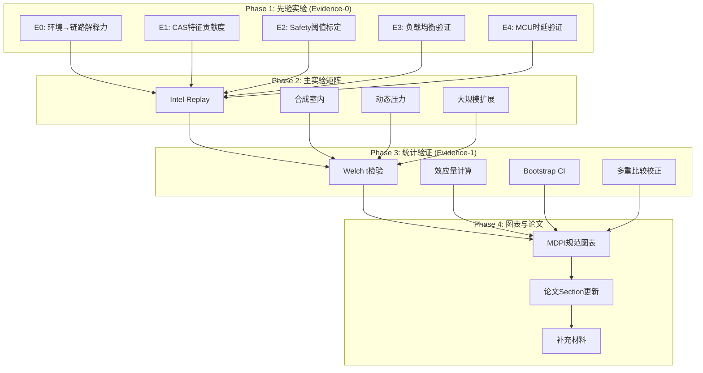
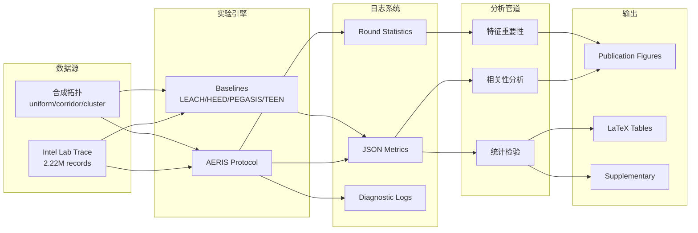

# Design Document: AERIS Publication-Ready Upgrade

## Overview

本设计文档描述将AERIS项目提升至MDPI Sensors发表标准的技术方案。核心设计原则是"三段式证据链"：机理/先验（Why）→ 先验实验（Evidence-0）→ 统计验证（Evidence-1）。

### 设计目标
1. 为每个关键指标/特征提供先验实验支撑
2. 修复或明确大规模网络PDR问题
3. 诚实定位动态场景性能
4. 重新评估CAS模块贡献度
5. 确保统计严谨性和可重复性
6. 图表符合MDPI规范

### 约束条件
- 不修改流程图（已定稿）
- 使用plotenv环境进行绑图
- 最大并行度由用户指定（建议8-16进程）
- 目标期刊：MDPI Sensors

## Architecture

### 整体架构



### 数据流架构



## Components and Interfaces

### 1. 先验实验模块 (scripts/prior_experiments/)

#### E0: 环境→链路解释力分析器
```python
class EnvironmentLinkAnalyzer:
    """分析环境特征与链路质量的关系"""
    
    def __init__(self, intel_trace_path: str):
        self.trace = load_intel_trace(intel_trace_path)
    
    def compute_correlation(self, env_feature: str, link_metric: str) -> CorrelationResult:
        """计算Pearson/Spearman相关性"""
        pass
    
    def compute_lagged_correlation(self, env_feature: str, link_metric: str, max_lag: int) -> LaggedCorrelationResult:
        """计算滞后相关性"""
        pass
    
    def train_predictor(self, features: List[str], target: str) -> PredictorResult:
        """训练链路成功/失败预测器，返回AUC/Brier"""
        pass
    
    def permutation_test(self, n_permutations: int = 1000) -> PermutationResult:
        """置换检验验证显著性"""
        pass
```

#### E1: CAS特征贡献度分析器
```python
class CASFeatureAnalyzer:
    """分析CAS特征对模式选择的贡献"""
    
    def __init__(self, round_stats: List[Dict]):
        self.stats = round_stats
    
    def compute_oracle_mode(self, lambda_energy: float) -> List[str]:
        """计算每轮的oracle最优模式"""
        pass
    
    def fit_interpretable_model(self, features: List[str]) -> InterpretableModelResult:
        """拟合可解释模型（logistic/GAM）"""
        pass
    
    def compute_shap_values(self) -> SHAPResult:
        """计算SHAP特征重要性"""
        pass
```

#### E2: Safety阈值标定器
```python
class SafetyThresholdCalibrator:
    """基于概率论标定safety阈值"""
    
    def __init__(self, round_pdrs: List[float]):
        self.pdrs = round_pdrs
    
    def fit_beta_binomial(self, window_size: int) -> BetaBinomialResult:
        """拟合Beta-Binomial模型"""
        pass
    
    def compute_trigger_probability(self, theta: float, T: int, confidence: float) -> float:
        """计算给定阈值的触发概率"""
        pass
    
    def optimize_threshold(self, target_fpr: float) -> Tuple[float, int]:
        """优化阈值以控制误触发率"""
        pass
```

#### E3: 负载均衡分析器
```python
class LoadBalanceAnalyzer:
    """分析负载分布与性能关系"""
    
    def __init__(self, round_stats: List[Dict]):
        self.stats = round_stats
    
    def compute_gini(self, loads: List[float]) -> float:
        """计算Gini系数"""
        pass
    
    def compute_jain_fairness(self, loads: List[float]) -> float:
        """计算Jain's fairness index"""
        pass
    
    def correlate_with_performance(self, metric: str) -> CorrelationResult:
        """分析负载均衡与性能指标的关系"""
        pass
```

#### E4: 决策时延分析器
```python
class DecisionLatencyAnalyzer:
    """分析决策时延分布和scaling"""
    
    def __init__(self, benchmark_data: Dict):
        self.data = benchmark_data
    
    def plot_ecdf(self, output_path: str) -> None:
        """绘制ECDF分布图"""
        pass
    
    def plot_scaling_curve(self, output_path: str) -> None:
        """绘制随规模增长曲线"""
        pass
    
    def compare_with_ml(self, ml_latencies: Dict[str, float]) -> ComparisonResult:
        """与ML/RL方法对比"""
        pass
```

### 2. 实验矩阵执行器 (scripts/experiment_matrix/)

```python
class ExperimentMatrix:
    """管理扩展实验矩阵的执行"""
    
    SCENARIOS = ['intel_replay', 'uniform', 'corridor', 'cluster', 'obstacle']
    SCALES = [100, 300, 500, 1000]
    LOADS = ['low', 'medium', 'high', 'bursty']
    
    def __init__(self, n_seeds: int = 30, n_workers: int = 8):
        self.n_seeds = n_seeds
        self.n_workers = n_workers
    
    def run_cell(self, scenario: str, scale: int, load: str, seed: int) -> Dict:
        """运行单个实验单元"""
        pass
    
    def run_matrix(self, output_dir: str) -> None:
        """并行运行完整矩阵"""
        pass
    
    def aggregate_results(self, results_dir: str) -> AggregatedResults:
        """聚合所有结果"""
        pass
```

### 3. 统计验证模块 (scripts/statistical_validation/)

```python
class StatisticalValidator:
    """统计验证管道"""
    
    def __init__(self, results: Dict):
        self.results = results
    
    def welch_t_test(self, group1: List[float], group2: List[float]) -> WelchResult:
        """Welch t检验"""
        pass
    
    def compute_effect_size(self, group1: List[float], group2: List[float], 
                           method: str = 'hedges_g') -> float:
        """计算效应量（Cliff's δ或Hedges g）"""
        pass
    
    def bootstrap_ci(self, data: List[float], n_bootstrap: int = 10000,
                    method: str = 'bca') -> Tuple[float, float]:
        """Bootstrap置信区间"""
        pass
    
    def holm_bonferroni_correction(self, p_values: List[float]) -> List[float]:
        """Holm-Bonferroni多重比较校正"""
        pass
```

### 4. 图表生成模块 (scripts/figure_generation/)

```python
class MDPIFigureGenerator:
    """MDPI规范图表生成器"""
    
    # MDPI Sensors规范
    MIN_WIDTH_PX = 1200
    FONT_FAMILY = 'Arial'
    FONT_SIZE = 10
    
    def __init__(self, output_dir: str):
        self.output_dir = output_dir
        plt.rcParams['svg.fonttype'] = 'none'  # 保留文字
    
    def create_figure(self, width_inches: float = 6.5, height_inches: float = 4.5) -> Figure:
        """创建符合规范的figure"""
        pass
    
    def save_figure(self, fig: Figure, name: str, formats: List[str] = ['pdf', 'svg', 'png']) -> None:
        """保存多格式图表"""
        pass
    
    def validate_figure(self, path: str) -> ValidationResult:
        """验证图表是否符合规范"""
        pass
```

## Data Models

### 实验结果数据模型
```python
@dataclass
class ExperimentResult:
    """单次实验结果"""
    scenario: str
    scale: int
    load: str
    seed: int
    protocol: str
    
    # 可靠性指标
    pdr_hop_level: float
    pdr_end2end: float
    pdr_p05: float  # 5th percentile (tail risk)
    pdr_p01: float  # 1st percentile
    
    # 能耗指标
    energy_total: float
    energy_per_packet: float
    energy_std: float
    
    # 开销指标
    control_packets: int
    retransmissions: int
    arq_triggers: int
    
    # 公平性指标
    jain_fairness: float
    gini_coefficient: float
    
    # 诊断信息
    hop_distribution: Dict[int, int]
    gateway_load: Dict[int, int]
    cas_mode_usage: Dict[str, int]
    
    # 元数据
    timestamp: str
    config: Dict

@dataclass
class PriorExperimentResult:
    """先验实验结果"""
    experiment_type: str  # E0/E1/E2/E3/E4
    
    # 相关性结果
    correlation_r: Optional[float]
    correlation_p: Optional[float]
    correlation_method: Optional[str]
    
    # 预测结果
    auc: Optional[float]
    brier_score: Optional[float]
    
    # 特征重要性
    feature_importance: Optional[Dict[str, float]]
    shap_values: Optional[Dict[str, float]]
    
    # 阈值标定
    optimal_theta: Optional[float]
    optimal_T: Optional[int]
    false_positive_rate: Optional[float]
    
    # 可视化路径
    figure_paths: List[str]
```

## Error Handling

### 实验失败处理
```python
class ExperimentErrorHandler:
    """实验错误处理"""
    
    def __init__(self, max_retries: int = 3):
        self.max_retries = max_retries
        self.failed_cells = []
    
    def handle_timeout(self, cell: ExperimentCell) -> None:
        """处理超时"""
        if cell.retries < self.max_retries:
            cell.retries += 1
            self.requeue(cell)
        else:
            self.failed_cells.append(cell)
            self.log_failure(cell, "timeout")
    
    def handle_memory_error(self, cell: ExperimentCell) -> None:
        """处理内存错误"""
        # 减少并行度后重试
        pass
    
    def generate_failure_report(self) -> str:
        """生成失败报告"""
        pass
```

### 统计验证失败处理
```python
class StatisticalValidationError(Exception):
    """统计验证错误"""
    pass

def validate_sample_size(n: int, min_n: int = 20) -> None:
    """验证样本量"""
    if n < min_n:
        raise StatisticalValidationError(
            f"Sample size {n} < minimum {min_n}. "
            f"Results may not be statistically reliable."
        )
```

## Testing Strategy

### 单元测试
```python
# tests/test_prior_experiments.py
class TestEnvironmentLinkAnalyzer:
    def test_correlation_computation(self):
        """测试相关性计算"""
        pass
    
    def test_permutation_test(self):
        """测试置换检验"""
        pass

class TestSafetyThresholdCalibrator:
    def test_beta_binomial_fit(self):
        """测试Beta-Binomial拟合"""
        pass
    
    def test_threshold_optimization(self):
        """测试阈值优化"""
        pass
```

### 集成测试
```python
# tests/test_experiment_pipeline.py
class TestExperimentPipeline:
    def test_single_cell_execution(self):
        """测试单个实验单元执行"""
        pass
    
    def test_result_aggregation(self):
        """测试结果聚合"""
        pass
    
    def test_statistical_validation(self):
        """测试统计验证管道"""
        pass
```

### 回归测试
```python
# tests/test_regression.py
class TestRegressionBaselines:
    def test_leach_pdr_range(self):
        """验证LEACH PDR在预期范围"""
        pass
    
    def test_aeris_decision_latency(self):
        """验证AERIS决策时延"""
        pass
```

## Implementation Timeline

### 第1周：先验实验 + 图表系统
- Day 1-2: 实现E0（环境→链路分析）
- Day 3-4: 实现E1（CAS特征贡献度）
- Day 5: 实现E2（Safety阈值标定）
- Day 6: 实现E3（负载均衡）+ E4（时延）
- Day 7: 统一图表风格系统 + 复现流水线

### 第2周：扩展实验矩阵 + 统计检验
- Day 8-10: 运行扩展实验矩阵（多seeds、多场景）
- Day 11-12: 统计检验 + 效应量计算
- Day 13-14: 主文6-8张图定稿

### 第3周：论文整合 + 提交准备
- Day 15-17: 全文重写/压缩主张
- Day 18-19: 补充材料（敏感性、全量检验矩阵）
- Day 20-21: 最终提交包准备

## Appendix: Key Scripts

### 一键复现脚本
```bash
# scripts/reproduce_all.sh
#!/bin/bash
set -e

# 激活plotenv环境
conda activate plotenv

# Phase 1: 先验实验
python scripts/prior_experiments/run_e0_env_link.py
python scripts/prior_experiments/run_e1_cas_features.py
python scripts/prior_experiments/run_e2_safety_threshold.py
python scripts/prior_experiments/run_e3_load_balance.py
python scripts/prior_experiments/run_e4_latency.py

# Phase 2: 主实验矩阵
python scripts/experiment_matrix/run_matrix.py --workers 8 --seeds 30

# Phase 3: 统计验证
python scripts/statistical_validation/run_all_tests.py

# Phase 4: 图表生成
python scripts/figure_generation/generate_all.py
python scripts/validate_figures.py

echo "All experiments completed. Check results/ for outputs."
```
